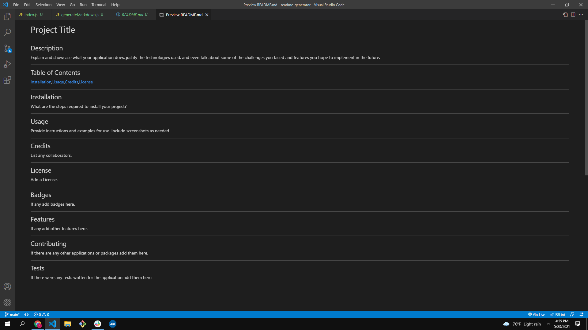

# README Generator
  ## Description
  Easily generate a README file by using a command-line application.
  ***
  ## Table of Contents
  [Installation](#installation),[Usage](#usage),[Credits](#credits),[License](#license)
  ***
  ## Installation
  The node inquirer needs to be installed first.(npm install inquirer).
  ***
  ## Usage
  https://github.com/mainmaster84/readme-generator,https://drive.google.com/file/d/16pGVNuhwiiB_f3vPz1AyyA8-jNmul_1j/view,
  ***
  ## Credits
  Ronald Main
  ***
  ## License
  MIT
  ***
  ## Badges
  None
  ***
  ## Features
  None
  ***
  ## Contributing
  None
  ***
  ## Tests
  None
